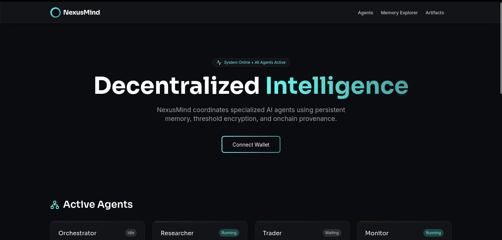

<p align="center">
  
</p>

<p align="center">
  <strong>Verifiable Multi-Agent Coordination with Persistent Memory</strong>
</p>

<p align="center">
  <a href="https://nexusmind.vercel.app">Live Dashboard</a> |
  <a href="docs/getting-started.md">Getting Started</a> |
  <a href="docs/architecture.md">Architecture</a> |
  <a href="docs/sdk-reference.md">SDK Reference</a>
</p>

---

# NexusMind

NexusMind is a framework for building AI agent systems where every agent action is verifiable onchain, every artifact is stored on decentralized infrastructure, and every memory persists across sessions. Agents coordinate through encrypted messaging, share knowledge through namespaced semantic memory, and produce tamper-proof provenance records on the Sui blockchain.

This is not a chatbot wrapper. It is a working coordination layer for autonomous agents backed by Sui Move smart contracts, Walrus decentralized storage, MemWal persistent memory, and Seal threshold encryption.

---

## Table of Contents

- [Architecture](#architecture)
- [Repository Structure](#repository-structure)
- [Technology Stack](#technology-stack)
- [Getting Started](#getting-started)
- [Move Contracts](#move-contracts)
- [SDK](#sdk)
- [Agent Demos](#agent-demos)
- [Dashboard](#dashboard)
- [Configuration](#configuration)
- [Testing](#testing)
- [Deployment](#deployment)
- [Documentation](#documentation)
- [License](#license)

---

## Architecture

NexusMind operates across four layers:

```
 Dashboard (Next.js 16)         Wallet Integration (@mysten/dapp-kit)
       |                             |
       v                             v
 +---------------------------------------------------+
 |                  Agent Layer                       |
 |  Orchestrator | Researcher | Trader | Monitor      |
 +---------------------------------------------------+
       |            |            |            |
       v            v            v            v
 +---------------------------------------------------+
 |              NexusMind SDK (@nexusmind/sdk)        |
 |  AgentMemory | ArtifactManager | SealManager       |
 +---------------------------------------------------+
       |            |            |            |
       v            v            v            v
 +---------------------------------------------------+
 |              Infrastructure Layer                  |
 |  MemWal    |  Walrus   |  Seal    |  Sui Stack Msg |
 |  (memory)  |  (blobs)  |  (enc)   |  (messaging)   |
 +---------------------------------------------------+
       |            |            |            |
       v            v            v            v
 +---------------------------------------------------+
 |              Sui Blockchain                        |
 |  AgentRegistry | AgentArtifact | Workflow | Events |
 +---------------------------------------------------+
```

**Agent Layer** -- Four specialist agents (Orchestrator, Researcher, Trader, Monitor) each with distinct roles, namespaced memory, and capability-gated permissions.

**SDK Layer** -- `@nexusmind/sdk` abstracts all infrastructure calls into a single `NexusMindAgent` class with typed methods for memory, artifacts, encryption, and messaging.

**Infrastructure Layer** -- MemWal provides semantic persistent memory backed by Walrus. Walrus stores all artifacts as content-addressed blobs. Seal provides threshold encryption for private cross-agent data sharing. Sui Stack Messaging enables encrypted agent-to-agent coordination.

**Blockchain Layer** -- Sui Move smart contracts govern agent registration, capability management, artifact provenance, and workflow state machines. Every agent action produces an onchain event.

---

## Repository Structure

```
nexusmind/
  .github/workflows/         CI and deploy pipelines
  agents/                    Agent implementations (orchestrator, researcher, trader, monitor)
  apps/dashboard/            Next.js 16 dashboard (the only Vercel deployment target)
    src/app/                 App Router pages and API routes
    src/components/          React components and design system
    src/hooks/               Data fetching hooks
    src/lib/                 Client configuration (Sui, Walrus, MemWal)
    src/types/               Shared TypeScript types
  docs/                      Technical documentation
  move/sources/              Sui Move smart contracts
  packages/nexusmind-sdk/    TypeScript SDK for agent development
  relayer/                   Sui Stack Messaging relay server
  scripts/                   Deployment and seed scripts
  tests/e2e/                 End-to-end test suite
```

---

## Technology Stack

| Layer | Technology | Purpose |
|---|---|---|
| Blockchain | Sui Move | Agent registry, artifact records, workflow state, capability management |
| Storage | Walrus | Decentralized blob storage for agent artifacts, logs, and datasets |
| Memory | MemWal | Persistent semantic memory with natural language recall and restore |
| Encryption | Seal | Threshold encryption for private agent-to-agent data sharing |
| Messaging | Sui Stack Messaging | Encrypted agent coordination with automatic Walrus archival |
| Frontend | Next.js 16, React 19, Tailwind CSS 4 | Dashboard with wallet integration |
| SDK | TypeScript | Unified developer interface over the full infrastructure stack |
| Tooling | Turborepo, pnpm, Vitest | Monorepo management, dependency resolution, unit testing |

---

## Getting Started

### Prerequisites

- Node.js 20 or later
- pnpm 9 or later
- A Sui wallet with testnet SUI tokens
- MemWal delegate key and account ID (from the MemWal Playground)

### Installation

```bash
git clone https://github.com/KikiProjecto/NexusMind.git
cd NexusMind
pnpm install
```

### Environment Configuration

Copy the example environment file and fill in all required values:

```bash
cp .env.example .env.local
```

Validate your configuration:

```bash
npx tsx scripts/check-env.ts
```

### Build

```bash
pnpm build
```

### Run the Dashboard Locally

```bash
pnpm --filter dashboard dev
```

The dashboard will be available at `http://localhost:3000`.

### Run Tests

```bash
pnpm test
```

---

## Move Contracts

Four Sui Move modules define the onchain protocol:

| Module | Purpose |
|---|---|
| `agent_registry.move` | Agent registration, role assignment, capability minting |
| `artifact_record.move` | Links Walrus blob IDs to agents with typed metadata |
| `seal_policies.move` | Seal `seal_approve` entry functions for access control |
| `workflow.move` | Workflow state machine (pending, running, completed, failed) |

### Deploy to Testnet

```bash
npx tsx scripts/deploy-move.ts
```

The script outputs the `MOVE_PACKAGE_ID` and `AGENT_REGISTRY_ID` values to set in your environment.

---

## SDK

The `@nexusmind/sdk` package provides a unified TypeScript interface:

```typescript
import { NexusMindAgent } from '@nexusmind/sdk';

const agent = new NexusMindAgent({
  role: 'researcher',
  namespace: 'nexusmind-researcher-v1',
  privateKey: process.env.AGENT_PRIVATE_KEY,
});

// Store a memory (persisted to Walrus via MemWal)
await agent.memory.remember(
  'DeFi analysis complete. TVL increased 34% across top protocols.'
);

// Recall semantically similar memories
const memories = await agent.memory.recall('DeFi TVL trends');

// Upload an artifact to Walrus
const { blobId } = await agent.artifacts.upload(reportData, {
  type: 'report',
  taskId: 'task-001',
});

// Encrypt data for another agent using Seal
const sealed = await agent.seal.encryptForAllowlist(data, allowlistId);
```

Full reference: [docs/sdk-reference.md](docs/sdk-reference.md)

---

## Agent Demos

Four agents demonstrate the framework capabilities:

| Agent | File | Description |
|---|---|---|
| Orchestrator | `agents/orchestrator.ts` | Coordinates multi-agent workflows, delegates tasks, aggregates results |
| Researcher | `agents/researcher.ts` | Analyzes market data, stores findings as encrypted Walrus artifacts |
| Trader | `agents/trader.ts` | Consumes research artifacts via Seal decryption, generates trading signals |
| Monitor | `agents/monitor.ts` | Tracks infrastructure health, logs network metrics |

Run an agent:

```bash
npx tsx agents/researcher.ts
```

Full guide: [docs/agent-demos.md](docs/agent-demos.md)

---

## Dashboard

The dashboard is deployed at [nexusmind.vercel.app](https://nexusmind.vercel.app) and provides:

- **Memory Explorer** -- Search and browse agent memories with natural language queries
- **Artifact Viewer** -- Inspect Walrus-stored artifacts with provenance and Seal encryption status
- **Workflow Debugger** -- Monitor workflow execution with live status updates
- **Agent Registry** -- View registered agents, their roles, capabilities, and activity
- **Memory Restore Demo** -- Demonstrates MemWal's `restore()` capability, proving memory portability from Walrus

---

## Configuration

All configuration is through environment variables. See `.env.example` for the complete list:

| Variable | Required | Description |
|---|---|---|
| `MEMWAL_DELEGATE_KEY` | Yes | MemWal delegate key (base64url, 32 bytes) |
| `MEMWAL_ACCOUNT_ID` | Yes | MemWal account identifier |
| `MEMWAL_SERVER_URL` | Yes | MemWal relayer endpoint |
| `WALRUS_NETWORK` | Yes | `testnet` or `mainnet` |
| `WALRUS_PUBLISHER_URL` | Yes | Walrus publisher endpoint |
| `WALRUS_AGGREGATOR_URL` | Yes | Walrus aggregator endpoint |
| `SUI_NETWORK` | Yes | `testnet` or `mainnet` |
| `SUI_RPC_URL` | Yes | Sui full node RPC URL |
| `AGENT_PRIVATE_KEY` | Yes | Ed25519 private key for agent transactions |
| `MOVE_PACKAGE_ID` | Yes | Deployed Move package object ID |
| `ANTHROPIC_API_KEY` | Yes | API key for agent LLM calls |

---

## Testing

Unit tests use Vitest with fully mocked clients (no network calls required):

```bash
# Run all tests
pnpm test

# Run with coverage
pnpm test -- --coverage

# Type check the entire monorepo
pnpm type-check

# Lint all packages
pnpm lint
```

---

## Deployment

The dashboard deploys automatically to Vercel on every push to `main`:

1. CI runs type-check, lint, and tests
2. If all pass, the deploy workflow builds and ships to `nexusmind.vercel.app`
3. Manual deployment: `vercel --prod` from the repo root

See `.github/workflows/` for pipeline definitions.

---

## Documentation

| Document | Description |
|---|---|
| [Getting Started](docs/getting-started.md) | Installation, configuration, and first-run guide |
| [Architecture](docs/architecture.md) | System design, component relationships, data flow |
| [SDK Reference](docs/sdk-reference.md) | Full API documentation for `@nexusmind/sdk` |
| [Agent Demos](docs/agent-demos.md) | How to run and extend each agent implementation |

---

## License

MIT License. See [LICENSE](LICENSE) for details.

---

Built with Sui Move, Walrus, MemWal, Seal, and Sui Stack Messaging.
